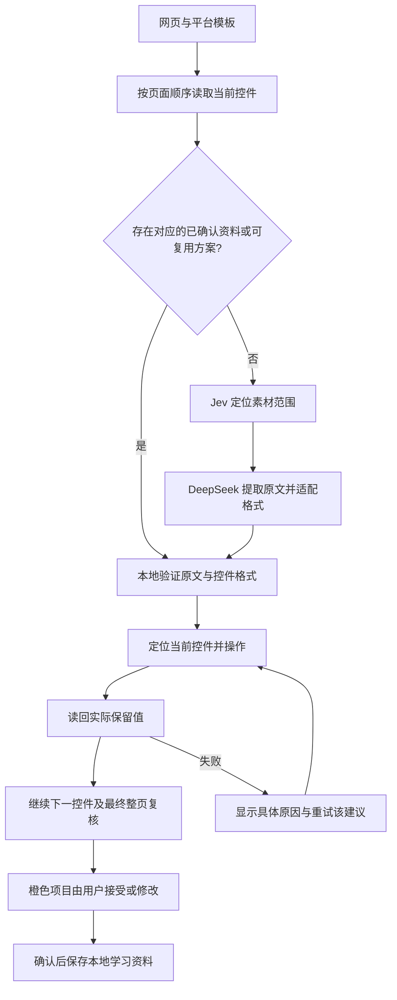

# 求职方舟 2026.10.6：实现分析与本轮借鉴

分析对象为用户提供的本地扩展包，manifest 版本 `2026.10.6`，23 个文件。包的 SHA256 为 `0efe84eca265de61891bd5868d621ef1ee57b2a9d904e668a41ba58dc8c9d9c8`。本轮静态检查了 manifest、页面操作脚本、界面脚本、后台和配置，并还原字符串引用以阅读控制流程。没有运行对方扩展或调用对方服务，分析后的源码保留在本机研究目录，不进入我们的源码包。

主要逻辑在 `js/arkContent.js`。界面在 `js/resumeInterface.js`，登录、请求转发、学习和历史记录在 `js/background.js`。前端可证明网页操作机制，但 `getNeedField`、`getResume`、`learningField` 等请求的服务器实现不在包里；无法据此验证模型提示、训练方式或真实准确率。

## 全流程观察与处理

| 观察到的机制 | 证据位置/行为 | 我们的处理 | 本轮状态 |
| --- | --- | --- | --- |
| 整页、分栏目、平台专用三条路径 | runFillResume 根据 mode 分支；S.h 明确处理智联/51job 部分版本 | 沿用 Moka/Hotjob/北森结构模板与通用回退，并保持用户要求的页面顺序 | 已有基础保留；未宣称新增智联/51job 全版本支持 |
| 压缩页面再识别字段 | k.i / k.p 等将 DOM 清理后的结构送到服务器；输入值和选项文字作为结构的一部分 | 继续发送结构化字段与受控素材范围，避免把整个招聘网页混入原文；经历、日期边界和字段身份持续携带 | 已有实现保留 |
| 点击后观察新菜单/弹窗 | N.bl 使用 DOM 变化、样式变化及动画事件发现新节点 | 短时观察菜单插入、显隐、控件替换；保留超时及属性变化的轮询回退。必须仍有唯一的控件归属 | 已实现；观察器在结束和出错时清理 |
| 元素失效后重新找字段 | k.L 在 dom 失效时调用 k.Ml；新增记录后重新识别 | 在原字段容器或仍存活的经历容器中按完整签名重新绑定。日期起止端、名称、类型和经历必须一致；重复候选或原经历已消失则报错 | 已实现；保留预警与原高亮样式，确认后正确取消高亮，不全页按同名字段盲找 |
| 多步骤激活再输入 | 模拟鼠标/焦点事件，然后 input/change/blur；点击可能激活可编辑状态 | 复用现有激活与失焦逻辑；新增激活后换节点的恢复，并检查激活期间是否出现用户新值 | 已实现 |
| 菜单内确认与值读取 | 单选、弹窗按钮、已选显示各有处理，选项不是普通输入文字 | 保留已知控件的内部确认和真实选中值读回；ARIA 指向菜单内部节点时解析到外部 listbox | 已增强；不会任意点击页面确认/保存按钮 |
| 月份与日期表示归一化 | 日历路径识别年月；将中文月份对应为数字后导航 | 支持同一已知年月组件中的 9、09月、九月及 2024年等表示，允许不透明选项 ID；只匹配唯一可用项 | 已实现；起止和原文证据继续验证 |
| 多段经历自动添加 | k.L 依据返回经历数量找附近添加按钮，再识别新增 DOM | 保留只在原栏目内新增、检查数量和旧值、禁止连续重复新增的现有协议；新控件替换后更容易继续读取 | 沿用并增强后续填写 |
| iframe 与富文本 | 跨同源文档访问、样式判断和可编辑节点识别 | 保留当前按 frame 隔离的扫描和写入。复杂富文本、无法访问的跨域 frame 仍需要实页适配 | 本轮未新增这些控件支持 |
| 自动学习人工修改 | 结束后每 5 秒比较 HTML，并在导航等时机交给服务器的 learningField | 保留显式接受/采用网页修改后的本地学习；新增“重试该建议”，成功后仍标橙，不把操作重试当成事实确认 | 已实现单项重试；零新增模型调用 |
| 浮动窗口、简历编辑、版本与进度 | Shadow DOM 界面、Markdown 编辑器、简历版本及阶段提示 | 沿用 Chrome/Edge 侧栏、PDF/TXT 本地素材和逐项进度；结果仅显示橙色预警，不增加全量列表 | 保持简化界面 |
| 登录、请求封装、历史记录 | 后台 JWT 刷新、自有网关、学习和历史服务 | 保持用户已有的两套官方模型接口与本地资料/密钥方案 | 本轮无新服务或权限 |

## 实现后的执行链

重试前再次核对素材、学习资料、拒绝反馈和当前页面；重查引用与经历，读取当前值作为写入比较条件。只处理该项，写后核验，成功仍待确认。素材或反馈已经变化时不使用旧建议。

对于重新生成的月份控件，原轮次年份操作产生的默认月份仍可纠正；新控件上发生真实人工交互后撤销这一默认值归属，保护用户改动。

测试还发现原引用检查在“有第一段明确经历，但没有第二段”时可能落回未分组素材规则。已补上明确记录边界检查；不能拿第一段的原文填到不存在的第二段。

## 保持的填写约束

描述文字来自准备好的原文；岗位美化路径不进入本轮流程。日期只使用已有精度，月份不会补成某月 1 日。网站保存/提交、声明同意、删除已有经历和不明弹窗确认仍不由自动填写执行。复杂未知控件或无法唯一定位的记录继续显示原因，不把尝试动作算成成功。

## 验证

89 项核心测试及 12 套相关浏览器回归通过。用旧版 v0.11.4 对照，复现并修复两项操作失败：点击激活重新生成输入框；年份选择重新生成月份控件。回归同时验证中文/补零月份、原经历内重定位、候选歧义拒绝、人工修改保护、菜单内部 ARIA 归属和观察器清理。

单项重试测试从真实的弹窗打开失败开始：首次两次模拟模型请求；修复页面状态后重试，模型请求仍为两次，读回成功且保持橙色，没有生成学习事实。随后素材变化会阻止旧建议重试。

真实 Chrome / SHEIN Moka 页面两轮均遍历 61 项，未保存或提交：首轮 30 秒、核对一致 42 项、待核对 11 项、失败 0 项、不适用或不支持 8 项；最终核心版本复测 29 秒、核对一致 40 项、待核对 13 项、失败 0 项、不适用或不支持 8 项，两轮均无新增写入。学校、专业、实习职位及原始教育年月保留。范围匹配仍有模型波动，不能据此宣称已达到竞品全表准确率。

这些结果证明本轮新增机制及相关回归，不是我们与求职方舟的受控准确率/耗时比较，也不代表所有网站、复杂日历和富文本均已支持。Windows 实机未复测。
